# Storybook Project

A simple Storybook project showcasing reusable React components.

---

## Components

### Input Component

A versatile input field with several useful features:

**Features:**
- Password visibility toggle
- Clearable input with X button
- Multiple types: text, password, email, number
- Disabled state
- Label support

---

### Screenshots

**Default input field**  
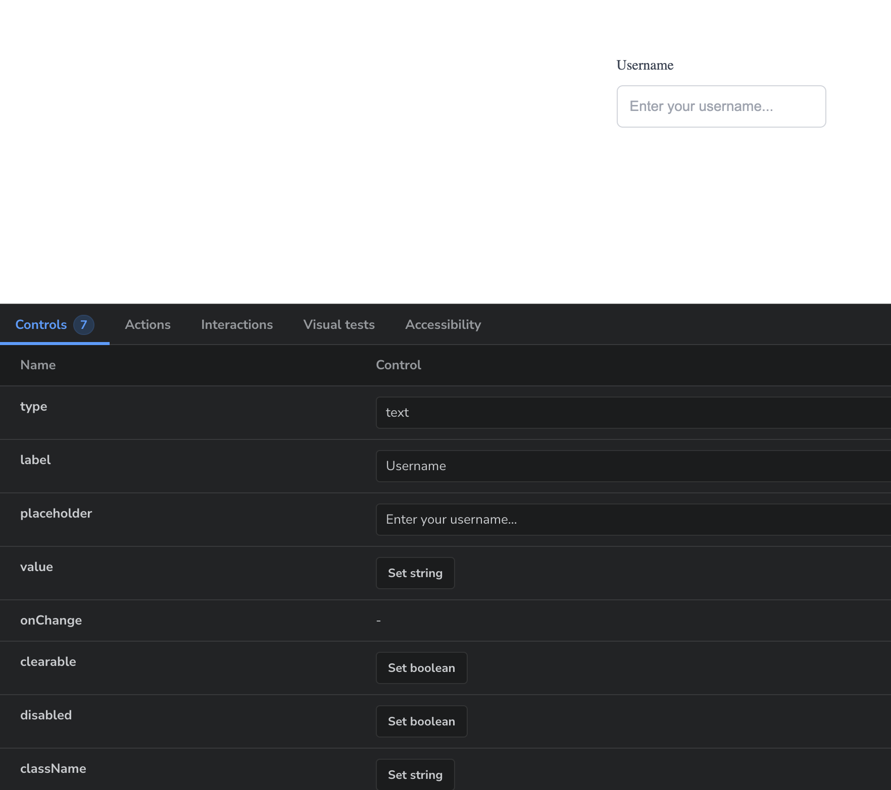

**Password input with visibility toggle**  
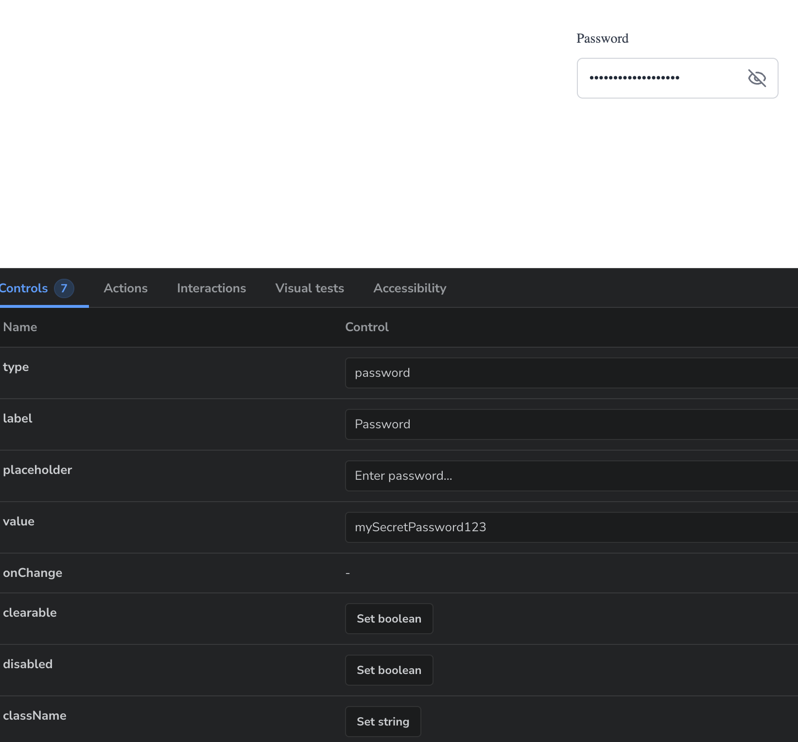

**Input with clear button**  


**Disabled state**  
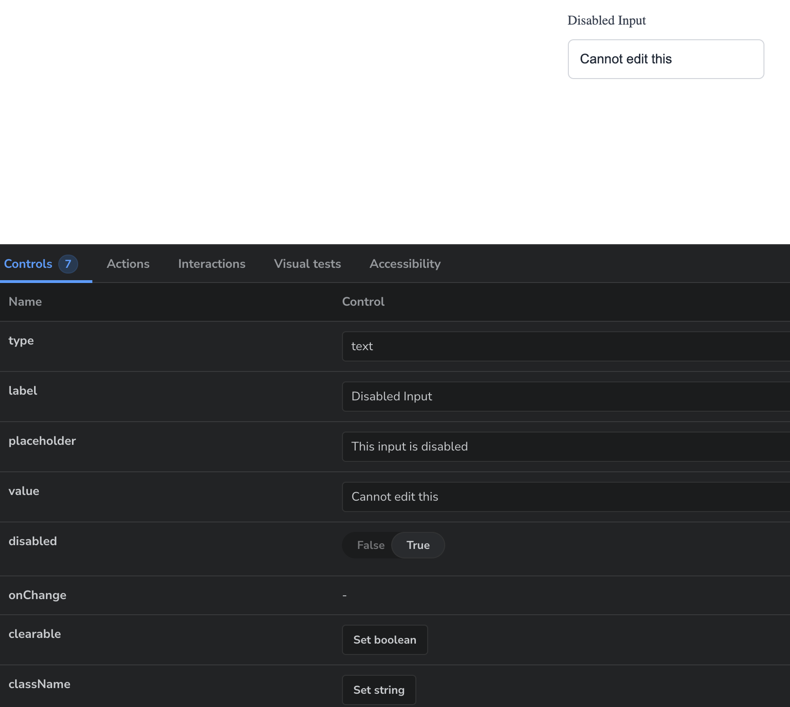

## Toast Component

A notification system with multiple types and smooth animations:

**Features:**
- Four notification types: Success, Error, Warning, Info
- Auto-dismiss with configurable duration
- Manual close button
- Smooth slide-in and slide-out animations

---

### Screenshots

**Success notification**  
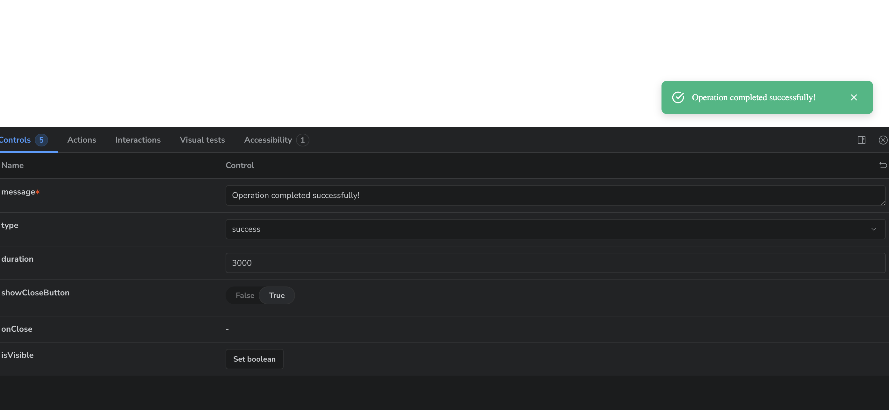

**Error notification**  
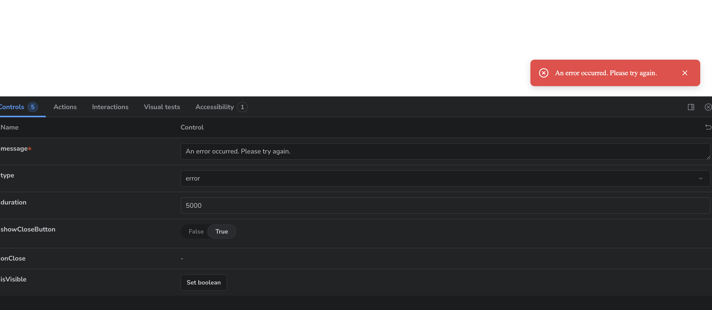

**Warning notification**  
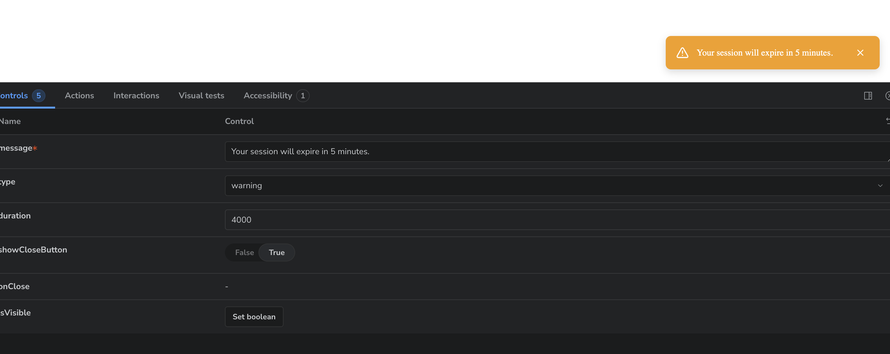

**Info notification**  
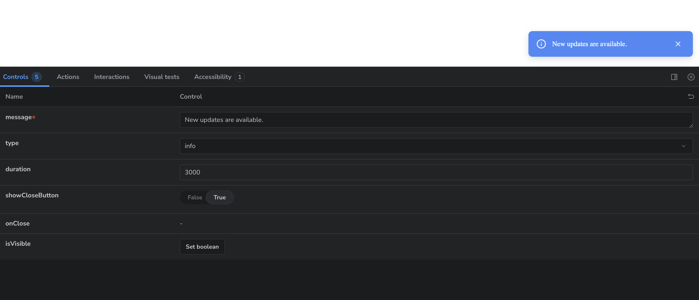

---

## Sidebar Menu Component

A responsive sidebar navigation with nested menu support:

**Features:**
- Slides in from the right side
- Nested accordion submenus with unlimited depth
- Overlay background that closes menu when clicked
- Click outside to close functionality
- Smooth animations for opening, closing, and expanding submenus
- Support for icons using lucide-react

---

### Screenshots

**Closed state with trigger button**  
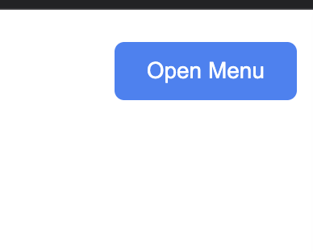

**Open sidebar with menu items**  
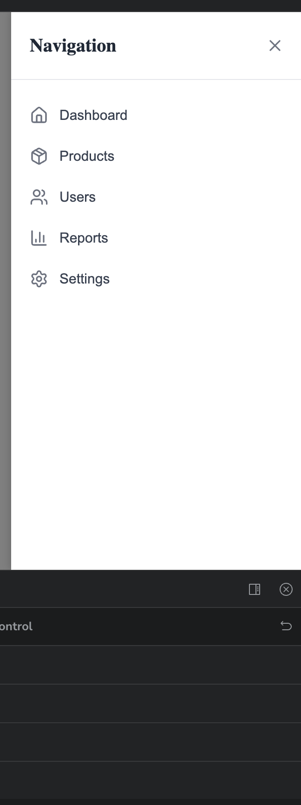

**Default sidebar**  
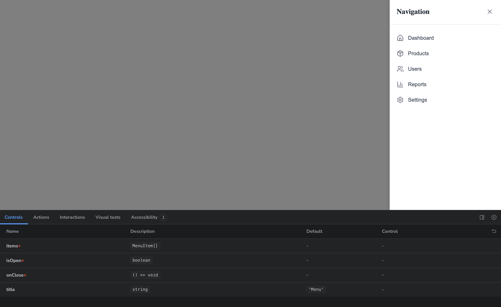

**Sidebar with expanded nested submenu**  
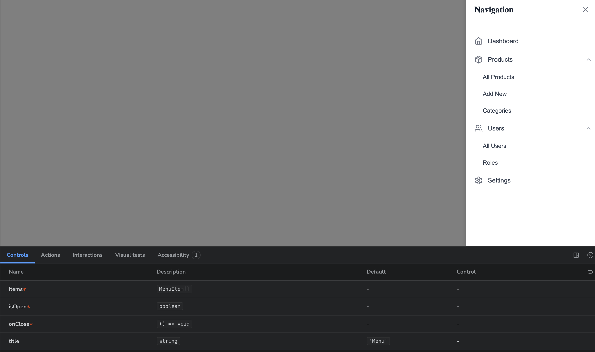

**Sidebar with expanded deep nested submenu**  
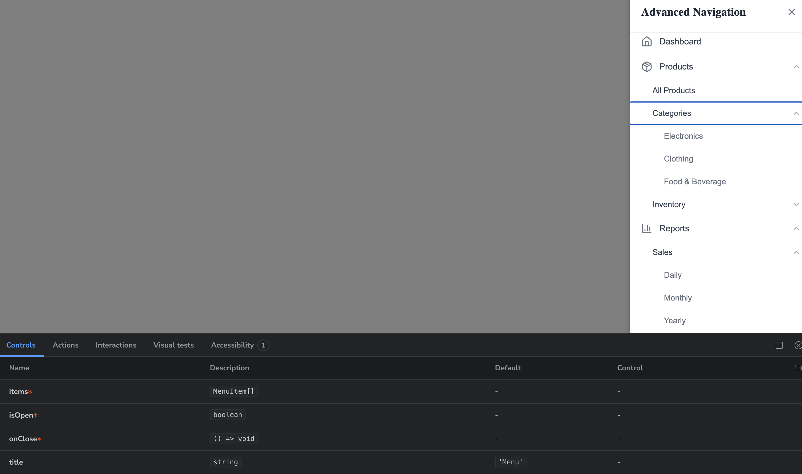

**Sidebar with long menu**  
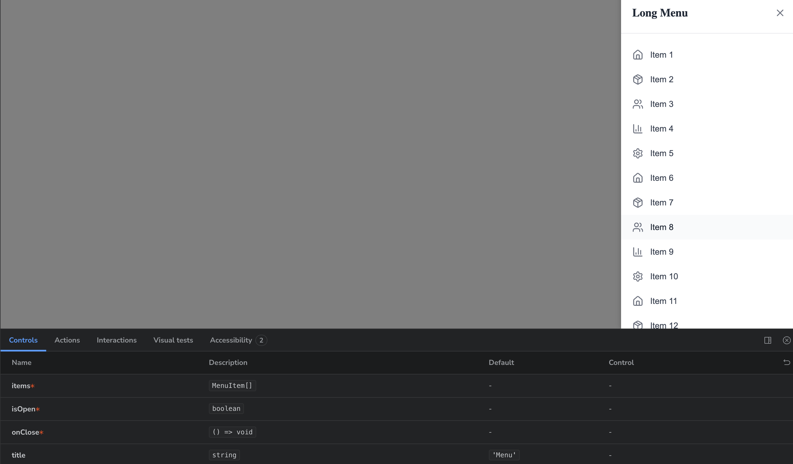

---

## Installation

```bash
# Install dependencies
npm install

# Run Storybook
npm run storybook
```

---